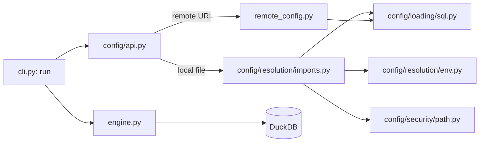

# Architecture: duckalog

_Last updated: 2026-04-14_

## Purpose

Duckalog is a Python library and CLI for building DuckDB catalogs from declarative YAML/JSON configuration files. A user writes a catalog config (views, attachments, secrets, settings) and Duckalog generates and executes the corresponding DuckDB SQL—either via the `duckalog run` CLI command, the `connect_to_catalog()` Python API, or an optional Litestar-based web dashboard.

## High-Level Design

The system is organized around three layers: **Configuration**, **Engine**, and **Interfaces**.

The **Configuration layer** (`src/duckalog/config/`) is the deepest part of the system. It parses and validates YAML/JSON into Pydantic models, resolves environment-variable interpolation, discovers `.env` files, expands config imports (one config file can import another), performs root-based path-security validation, and loads external SQL files into inline statements. This layer is intentionally thick: callers invoke `load_config()` and receive a fully materialized `Config` object without knowing about the sequencing of interpolation, import resolution, or security checks.

The **Engine layer** (`src/duckalog/engine.py`, `src/duckalog/connection.py`) takes a validated `Config` and orchestrates DuckDB. `CatalogBuilder` (engine) is a stateful workflow object that opens a DuckDB connection, applies pragmas, creates secrets, sets up attachments (DuckDB, SQLite, Postgres, or nested Duckalog catalogs), and creates views. `CatalogConnection` (connection) provides the Python API entry point: it lazily initializes a DuckDB connection, restores session state, and performs incremental view updates so that repeated `get_connection()` calls return a catalog-ready connection.

The **Interface layer** exposes three surfaces: a **Typer CLI** (`src/duckalog/cli.py`) for command-line usage, a **Python API** (`src/duckalog/python_api.py`) for programmatic access, and an optional **Web Dashboard** (`src/duckalog/dashboard/`) for browsing views and running ad-hoc queries. The CLI is the largest file in the project (~1,500+ lines) and acts as the primary user-facing orchestrator.

## Module Map

### `duckalog.config`

- Path: `src/duckalog/config/`
- Responsibility: Parse, validate, interpolate, and secure catalog configuration files.
- Boundary: Hides the entire chain of env resolution, import expansion, path validation, and SQL-file loading behind `load_config()`.
- Depends on: `pydantic`, `python-dotenv`, `pyyaml`, `duckalog.remote_config` (optional, for remote URIs)

### `duckalog.config.models`

- Path: `src/duckalog/config/models.py`
- Responsibility: Pydantic schema definitions for the entire configuration surface (`Config`, `ViewConfig`, `SecretConfig`, `AttachmentsConfig`, etc.).
- Boundary: Guarantees that any `Config` instance is structurally valid before it reaches the engine.
- Depends on: `pydantic`

### `duckalog.config.api`

- Path: `src/duckalog/config/api.py`
- Responsibility: Public entry point for configuration loading. Decides whether a path is remote (delegates to `remote_config`) or local (delegates to `config/resolution/imports.py`).
- Boundary: Hides the remote-vs-local branching from callers.
- Depends on: `duckalog.config.models`, `duckalog.config.resolution.imports`, `duckalog.remote_config` (optional)

### `duckalog.config.resolution.imports`

- Path: `src/duckalog/config/resolution/imports.py`
- Responsibility: The actual implementation of local config loading: import-chain resolution, cyclic-import detection, glob expansion, SQL-file inlining, and name deduplication.
- Boundary: Hides the complexity of transitive config imports and file-system traversal.
- Depends on: `duckalog.config.models`, `duckalog.config.loading.sql`, `duckalog.config.resolution.env`

### `duckalog.config.security.path`

- Path: `src/duckalog/config/security/path.py`
- Responsibility: Root-based path security (directory traversal prevention, allowed-root validation, and path normalization).
- Boundary: Hides platform-specific path rules and security policy.
- Depends on: `pathlib`

### `duckalog.config.validators`

- Path: `src/duckalog/config/validators.py`
- Responsibility: Re-exports path helpers from `security/path.py`, provides redacted logging wrappers, and resolves relative paths inside a loaded config.
- Boundary: **Shallow** — mostly a delegation layer with minimal added value. The path helpers and logging functions could be collapsed into their canonical homes.
- Depends on: `duckalog.config.security.path`, `loguru`

### `duckalog.engine`

- Path: `src/duckalog/engine.py`
- Responsibility: Build a DuckDB catalog from a validated `Config`: secrets, attachments, pragmas, view creation, and optional remote export.
- Boundary: **Leaky** — `CatalogBuilder.build()` is a long orchestration method that mixes connection management, SQL generation, and file upload. The sequencing is visible to maintainers but not to callers.
- Depends on: `duckdb`, `duckalog.config`, `duckalog.sql_generation`, `duckalog.sql_utils`, `fsspec` (optional)

### `duckalog.connection`

- Path: `src/duckalog/connection.py`
- Responsibility: Manage DuckDB connections with lazy initialization, session-state restoration, and incremental view updates.
- Boundary: Hides connection lifecycle and state replay from Python callers.
- Depends on: `duckdb`, `duckalog.config`, `duckalog.engine` (imports private helpers for state setup)

### `duckalog.sql_generation`

- Path: `src/duckalog/sql_generation.py`
- Responsibility: Generate DuckDB SQL (`CREATE SECRET`, `CREATE OR REPLACE VIEW`, `ATTACH`, etc.) from Pydantic models.
- Boundary: Hides provider-specific SQL dialects, but the `generate_secret_sql()` function is a very long switch statement that could be deeper.
- Depends on: `duckalog.config.models`, `duckalog.sql_utils`

### `duckalog.cli`

- Path: `src/duckalog/cli.py`
- Responsibility: Typer-based command-line interface (`run`, `show-paths`, `show-imports`, `query`, `init`, `validate`, `ui`, etc.).
- Boundary: **Shallow and wide** — the CLI absorbs a lot of complexity directly (filesystem factory with 12 parameters, error handling repeated 7+ times, mixed concerns of SQL generation, building, and display formatting).
- Depends on: nearly every other module in `src/duckalog/`

### `duckalog.dashboard`

- Path: `src/duckalog/dashboard/`
- Responsibility: Optional Litestar web UI for browsing catalog views and running read-only queries.
- Boundary: Isolated from the CLI and engine except through `DashboardContext`.
- Depends on: `litestar`, `htpy`, `uvicorn`, `duckalog.config`

### `duckalog.remote_config`

- Path: `src/duckalog/remote_config.py`
- Responsibility: Load configuration files from remote URIs (S3, GCS, Azure, HTTP, SFTP) via fsspec.
- Boundary: Hides fsspec protocol details from the config loader.
- Depends on: `fsspec`, `duckalog.config.loading.sql`

## Data Flow

A typical `duckalog run catalog.yaml` invocation follows this path:

1. **CLI** (`cli.py`) parses arguments, optionally creates an fsspec filesystem, and calls `load_config(config_path)`.
2. **Config API** (`config/api.py`) checks whether the path is remote. If so, it delegates to `remote_config.load_config_from_uri()`; otherwise it delegates to `_load_config_from_local_file()`.
3. **Import Resolver** (`config/resolution/imports.py`) loads the base file, expands any `imports:` declarations recursively, resolves `.env` interpolation via `resolution/env.py`, inlines SQL file references via `loading/sql.py`, and validates path security via `security/path.py`.
4. **Engine** (`engine.py`) receives the fully materialized `Config` object. `CatalogBuilder` opens DuckDB, applies settings, creates secrets, attaches databases, and executes `CREATE OR REPLACE VIEW` statements for each view.
5. **Connection** (Python API only) — `CatalogConnection` wraps the DuckDB connection and restores state on every access.

## Key Design Decisions

- Decision: The configuration layer is intentionally deep. All parsing, interpolation, import expansion, and path security happen behind `load_config()` so that the engine and CLI work only with validated Pydantic models.
  Rationale: Reduces change amplification when the config schema evolves; callers above `load_config()` never touch raw YAML or file paths.
  Date: 2026-04-14

- Decision: `build_catalog()` was removed from the public Python API (`__init__.py`) but retained as an internal helper inside `engine.py` without renaming.
  Rationale: The function is still useful internally (e.g., `run --dry-run` and the dashboard), but renaming it would create churn outside the current cleanup scope.
  Date: 2026-04-14

- Decision: The dashboard is an optional `[ui]` extra, isolated in `src/duckalog/dashboard/` and wired together via Litestar dependency injection (`DashboardContext`).
  Rationale: Keeps the core library lightweight; web dependencies are not required for CLI or Python API usage.
  Date: 2026-04-14

- Decision: `duckalog.config.validators` was created as a consolidation layer for path helpers and redacted logging, but it ended up as a thin wrapper over `security/path.py`.
  Rationale: The intention was to reduce module sprawl, but the result is a shallow boundary that adds an extra hop for most path operations.
  Date: 2026-04-14

## Directory Structure

    src/duckalog/
    ├── __init__.py           # Public Python API exports
    ├── cli.py                # Typer CLI (~1,500 lines, primary user surface)
    ├── python_api.py         # High-level Python convenience functions
    ├── connection.py         # DuckDB connection manager with state restoration
    ├── engine.py             # Catalog build orchestration
    ├── sql_generation.py     # DuckDB SQL generators
    ├── sql_utils.py          # SQL quoting and option rendering
    ├── sql_file_loader.py    # SQL file loading and template processing
    ├── remote_config.py      # Remote config loading via fsspec
    ├── config_init.py        # `duckalog init` template generator
    ├── errors.py             # Unified exception hierarchy
    ├── benchmarks.py         # Performance benchmarking utilities
    ├── performance.py        # Runtime performance helpers
    ├── config/               # Configuration layer
    │   ├── __init__.py       # Config package public API
    │   ├── api.py            # load_config() entry point
    │   ├── models.py         # Pydantic schema definitions
    │   ├── validators.py     # Path/log wrappers (shallow consolidation)
    │   ├── interpolation.py  # DEPRECATED proxy module
    │   ├── loading/          # SQL-file loading
    │   │   ├── __init__.py
    │   │   ├── sql.py        # Real SQL-file reference processor
    │   │   ├── base.py       # Unused ABCs
    │   │   ├── file.py       # Empty stub
    │   │   └── remote.py     # Empty stub
    │   ├── resolution/       # Config interpolation & imports
    │   │   ├── imports.py    # Import-chain resolver
    │   │   ├── env.py        # .env and ${env:VAR} interpolation
    │   │   └── base.py       # Abstract resolver interfaces
    │   └── security/         # Path security
    │       ├── base.py       # Abstract path validator
    │       └── path.py       # Root-based traversal prevention
    ├── dashboard/            # Optional Litestar web UI
    │   ├── app.py            # Litestar app factory
    │   ├── state.py          # DashboardContext
    │   ├── components/
    │   │   └── layout.py     # htpy HTML components
    │   └── routes/
    │       ├── home.py       # Catalog overview
    │       ├── views.py      # View browser
    │       └── query.py      # Query + Build controllers
    └── static/               # Dashboard static assets

## Dependencies

| Dependency | Version | Purpose |
|------------|---------|---------|
| duckdb | >=0.8.0 | Core analytical database engine |
| pydantic | >=2.0.0 | Config schema validation |
| pyyaml | >=6.0 | YAML config parsing |
| typer | >=0.20.0 | CLI framework |
| click | >=8.0.0 | Underlying CLI toolkit (Typer dependency) |
| loguru | >=0.7.0 | Structured logging with redaction |
| python-dotenv | >=1.0.0 | `.env` file discovery |
| datastar-py | >=0.7.0 | Reactive SSE framework for dashboard |
| litestar | >=2.0.0 | Optional web framework (`[ui]` extra) |
| htpy | >=0.1.0 | Optional type-safe HTML builder (`[ui]` extra) |
| uvicorn | >=0.24.0 | Optional ASGI server (`[ui]` extra) |
| fsspec | >=2023.6.0 | Optional remote filesystems (`[remote]` extra) |

## Open Questions

- Should `duckalog.config.validators` be folded into `duckalog.config.security.path` and `duckalog.config.api` so that the delegation layer disappears?
- Should `CatalogBuilder.build()` be split into phase methods (`_build_secrets`, `_build_attachments`, `_build_views`) to reduce the 180+ line orchestration method?
- Is `dashboard/routes/query.py:BuildController` still meaningful now that the `build` CLI command and public `build_catalog` export have been removed? Should it be renamed to `RunController` or removed entirely?
- How should the `_is_remote_uri()` helper be consolidated? It currently exists in four places (`remote_config.py`, `config/resolution/imports.py`, `config/resolution/env.py`, `config/loading/sql.py`).

## Complexity Assessment

### Deep Modules (good)

- `duckalog.config.resolution.imports`: Hides transitive config imports, cyclic-import detection, glob expansion, and SQL-file inlining behind `_load_config_with_imports()`.
- `duckalog.config.security.path`: Hides platform-specific path rules, root validation, and traversal prevention behind a small public surface.
- `duckalog.connection`: Hides DuckDB connection lifecycle, session-state restoration, and incremental view updates from Python callers.

### Shallow Boundaries (candidates for deepening)

- `duckalog.config.validators`: Nine path functions are thin wrappers around `security/path.py`, and four logging functions are thin wrappers around `loguru`. This module adds hops without hiding meaningful policy.
- `duckalog.config.loading.base`: Defines `ConfigLoader` and `SQLFileLoader` ABCs with no concrete subclasses left in the tree. The abstraction is unused and adds cognitive load.
- `duckalog.cli._create_filesystem_from_options`: A 217-line function with 12 parameters and deep protocol-specific `if/elif` chains. Each protocol (S3, GCS, SFTP, etc.) should be a small private helper called by a thin dispatcher.

### Leaky Abstractions

- `duckalog.cli`: The CLI directly orchestrates filesystem creation, SQL generation, catalog building, interactive mode, and table display. These concerns leak into one mega-module because there is no stable boundary between "CLI argument parsing" and "CLI action execution."
- `duckalog.engine.CatalogBuilder`: The `build()` method exposes the exact sequencing of connection → pragmas → secrets → attachments → views → export. Callers don't see this, but maintainers do, and the long method makes changes fragile.
- `duckalog.sql_generation.generate_secret_sql`: A 169-line provider switch statement. The provider-specific SQL dialects are not hidden behind small generators, so adding a new secret provider requires touching a large function.
