# Duckalog Architecture

Duckalog is a Python library and CLI for building DuckDB catalogs from declarative YAML/JSON configuration files. This document provides a comprehensive architectural overview of the system, its components, and how they work together to transform configuration files into functional DuckDB catalogs.

## System Overview

Duckalog follows a **config-driven, idempotent architecture** that transforms declarative configuration into functional DuckDB catalogs. The system is designed around separation of concerns, with clear boundaries between configuration loading, validation, SQL generation, and catalog execution.

### Core Philosophy

- **Configuration as Code**: Catalogs are defined in version-controllable YAML/JSON files
- **Idempotent Operations**: Running the same config produces the same catalog every time
- **Multi-Source Integration**: Unified interface for S3 Parquet, Delta Lake, Iceberg, and relational databases
- **Environment-Driven**: Credentials and connection details sourced from environment variables
- **Separation of Concerns**: Clear boundaries between configuration, validation, generation, and execution

### High-Level System Architecture

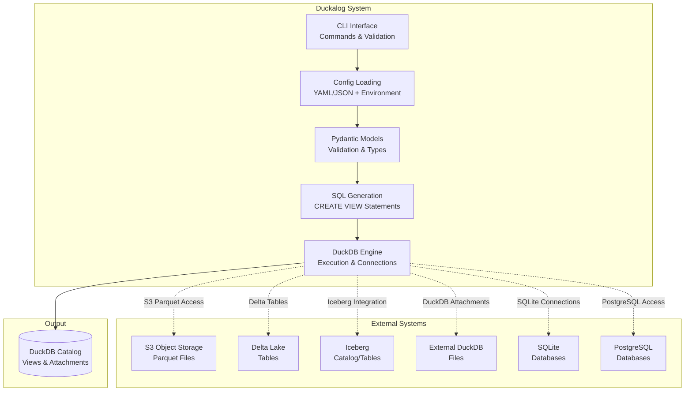

## Core Architecture Components

The system consists of five primary modules that work together to process configurations and create DuckDB catalogs:

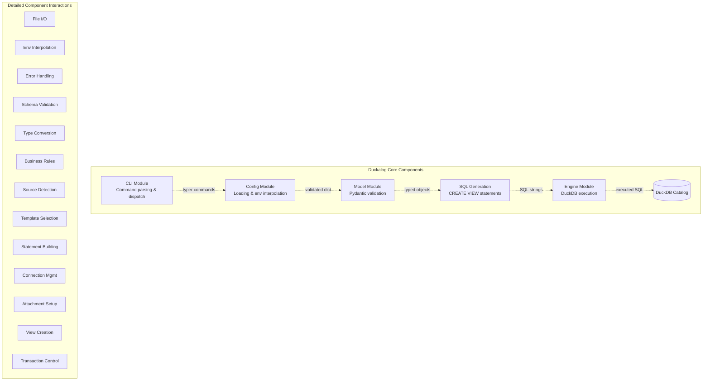

## Path Security Architecture

### Security Boundaries and Validation

Duckalog implements comprehensive path security to prevent directory traversal attacks while maintaining usability:

**Path Security Principles:**
- **Rooted Resolution**: All relative paths are resolved relative to the configuration file location
- **Traversal Protection**: Blocks attempts to escape the configuration directory tree
- **Parent Directory Access**: Allows controlled access to parent directories for shared resource patterns
- **Cross-Platform Security**: Consistent validation across Windows, macOS, and Linux

**Security Validation Flow:**
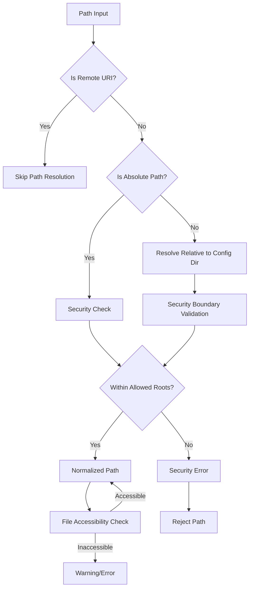

**Path Resolution Behavior:**
- **Relative Paths**: `data/file.parquet` → `/config/dir/data/file.parquet`
- **Parent Access**: `../shared/data.parquet` → Allowed if within security bounds
- **Security Blocks**: `../../../etc/passwd` → Security error
- **Remote URIs**: `s3://bucket/file.parquet` → No local path resolution

**Implementation Details:**
- **`validate_path_security()`**: Core validation function
- **`is_within_allowed_roots()`**: Checks path boundaries
- **`normalize_path_for_sql()`**: SQL-safe path formatting
- **`validate_file_accessibility()`**: Runtime accessibility verification

### Secret Management Architecture

**Canonical Secret Model:**
Duckalog uses a unified `SecretConfig` model for all credential management:

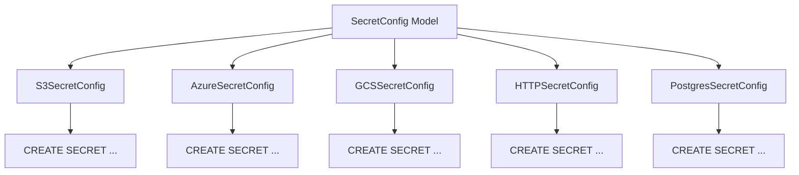

**Secret Types Supported:**
- **S3**: Access keys, secret keys, regions, endpoints
- **Azure**: Connection strings, tenant IDs, client credentials
- **GCS**: Service account keys, JSON credentials
- **HTTP**: Bearer tokens, custom headers
- **PostgreSQL**: Connection strings, host/port/user/password

**Security Features:**
- **Environment Variable Integration**: `${env:VARIABLE_NAME}` substitution
- **No Secrets in Config**: All sensitive data via environment variables
- **Automatic Redaction**: Logging automatically hides sensitive information
- **DuckDB Integration**: Direct mapping to DuckDB `CREATE SECRET` statements

## Remote Configuration Architecture

### Remote Access Support

Duckalog supports loading configurations from remote sources using fsspec-compatible filesystems:

**Supported Protocols:**
- **S3**: `s3://bucket/config.yaml` with AWS credentials
- **GCS**: `gs://bucket/config.yaml` with service account
- **Azure**: `abfs://account@container/config.yaml` with connection string
- **SFTP**: `sftp://server/path/config.yaml` with SSH keys
- **HTTP/HTTPS**: `https://example.com/config.yaml` with tokens

**Remote Loading Process:**
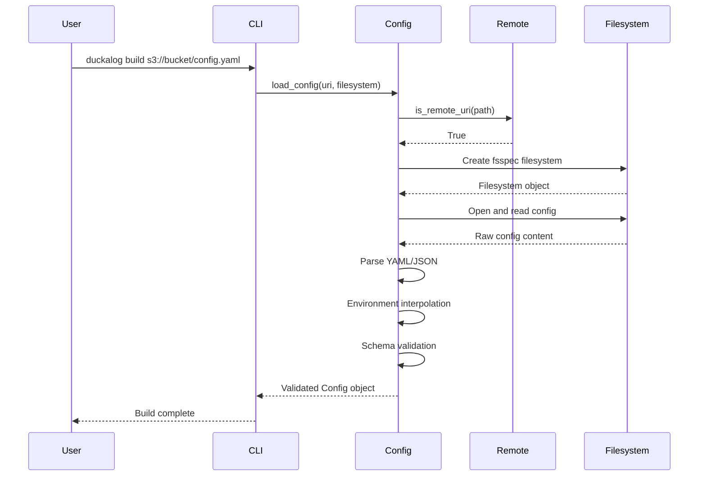

**Filesystem Integration:**
- **CLI Shared Options**: All remote access options centralized via Typer callback
- **Context Management**: Filesystem objects stored in `ctx.obj["filesystem"]`
- **Credential Handling**: Secure credential management through environment variables
- **Fallback Support**: Graceful degradation when remote dependencies unavailable

**Responsibilities:**
- Load YAML/JSON configuration files with unified interface
- Perform environment variable interpolation and path resolution
- Validate configuration schema and security boundaries
- Handle file I/O, remote access, and error management

**Key Components:**
- **`models.py`**: Pydantic models for configuration schema validation
- **`loader.py`**: Core configuration loading functionality
- **`interpolation.py`**: Environment variable substitution engine
- **`validators.py`**: Path security validation and normalization
- **`sql_integration.py`**: SQL file loading and template processing

**Key Features:**
- Supports both YAML and JSON formats
- Environment variable substitution using `${env:VAR_NAME}` pattern
- Automatic path resolution with security validation
- Remote configuration loading via fsspec filesystems
- Comprehensive error handling with descriptive messages

**Example Flow:**
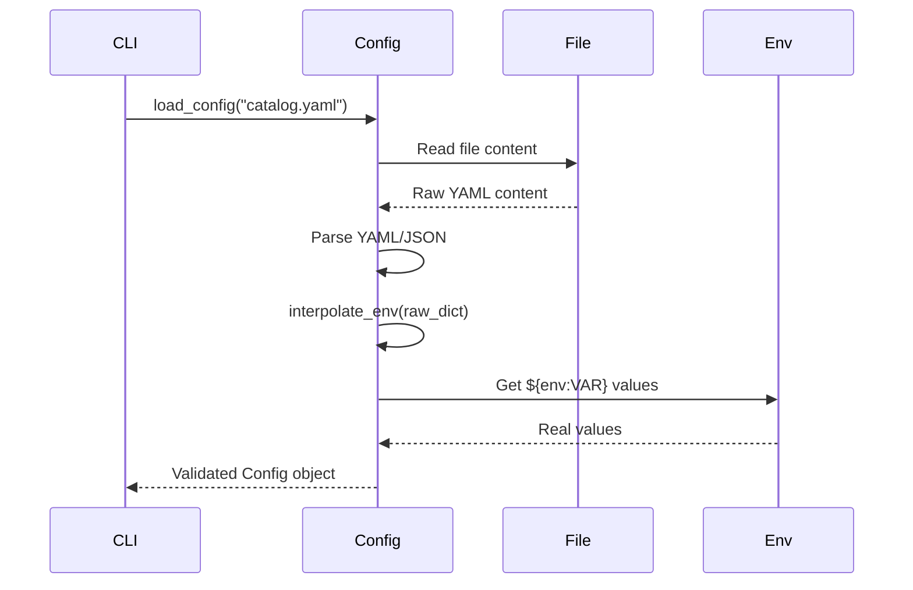

### 2. Configuration Models Package (`duckalog.config.models`)

**Responsibilities:**
- Define Pydantic models for configuration schema
- Provide comprehensive data validation and type checking
- Ensure configuration consistency and business rule enforcement
- Support extensibility for new configuration types including secrets

**Core Models:**
- **`Config`**: Root configuration aggregating all components
- **`DuckDBConfig`**: Database file, session settings, and pragmas
- **`SecretConfig`**: Canonical secret configuration for DuckDB CREATE SECRET statements
- **`AttachmentsConfig`**: External database connections (DuckDB, SQLite, Postgres)
- **`IcebergCatalogConfig`**: Iceberg catalog connections with authentication
- **`ViewConfig`**: Individual view definitions and source specifications
- **`SemanticModelConfig`**: Semantic layer definitions for analytics

**Validation Flow:**
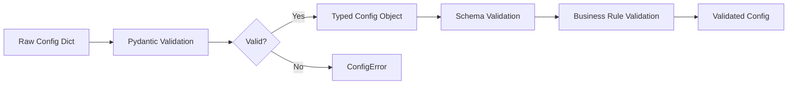

### 3. SQL Generation Module (`sql_generation.py`)

**Responsibilities:**
- Transform typed configuration objects into SQL statements
- Generate `CREATE VIEW` statements for different source types
- Handle SQL escaping, identifier quoting, and secret management
- Support complex view definitions with joins and aggregations

**Source Types Supported:**
- **Parquet**: S3-based Parquet file views with access credentials
- **Delta Lake**: Delta table references with table options
- **Iceberg**: Iceberg table and catalog views with authentication
- **Database**: Attached DuckDB/SQLite/Postgres tables with connection details
- **SQL**: Raw SQL query views with template processing
- **Secrets**: DuckDB `CREATE SECRET` statements for credential management

**SQL Generation Process:**
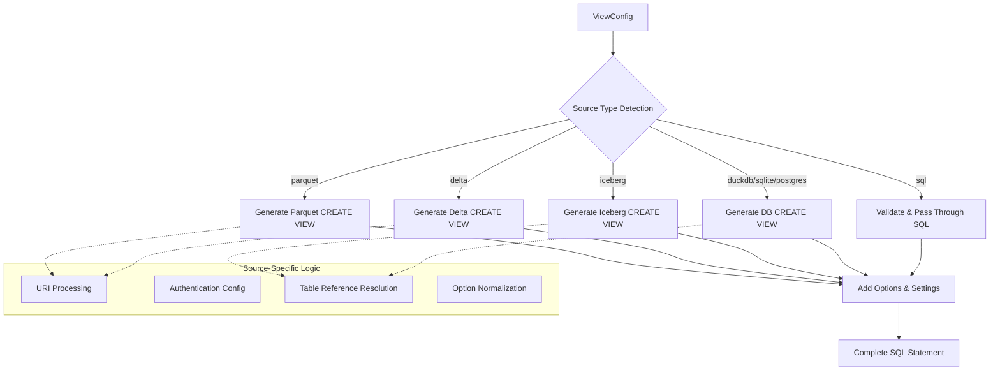

### 4. Engine Module (`engine.py`) with CatalogBuilder Orchestration

**Responsibilities:**
- Orchestrate catalog building workflow through `CatalogBuilder` class
- Manage DuckDB connections and sessions with proper lifecycle management
- Set up external attachments and catalogs with security validation
- Execute generated SQL statements with transaction management
- Handle error recovery and cleanup operations

**CatalogBuilder Workflow:**
- **Connection Management**: Open and maintain DuckDB connections with proper cleanup
- **Pragma Application**: Configure session settings and memory limits
- **Attachment Setup**: Configure DuckDB, SQLite, and Postgres connections securely
- **Catalog Configuration**: Set up Iceberg catalogs with proper authentication
- **Secret Creation**: Apply DuckDB secrets from `SecretConfig` models
- **View Execution**: Apply generated SQL to create views in the catalog
- **Remote Export**: Support exporting catalogs to remote storage systems

**Engine Architecture Benefits:**
- **Clear Method Boundaries**: Each operation is a separate, testable method
- **Resource Management**: Automatic cleanup of connections and temporary files
- **Error Isolation**: Failures don't leave system in inconsistent state
- **Extensibility**: Easy to add new catalog building steps

**Engine Workflow:**
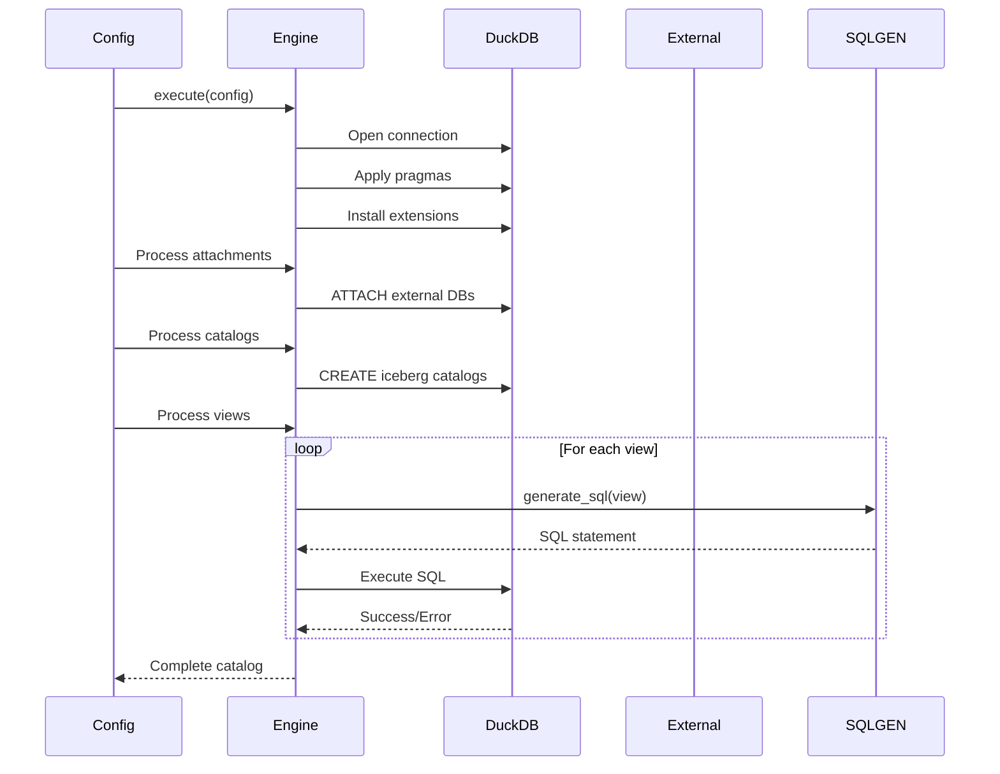

### 5. CLI Module (`cli.py`)

**Responsibilities:**
- Provide command-line interface for users with shared filesystem options
- Parse command-line arguments and dispatch to appropriate library functions
- Handle user input validation and error reporting
- Manage filesystem objects consistently across commands

**Shared Filesystem Architecture:**
- **Centralized Options**: All filesystem-related CLI options (--fs-protocol, --fs-key, etc.) are declared once at application level
- **Context Management**: Filesystem objects are created by application callback and stored in `ctx.obj["filesystem"]`
- **Command Simplicity**: Individual commands (build, generate-sql, validate) have clean signatures without filesystem parameter clutter

**Available Commands:**
- `build`: Create or update a DuckDB catalog from configuration
- `generate-sql`: Generate SQL statements without executing them
- `validate`: Validate configuration files for syntax and schema correctness
- `init`: Initialize new configuration files from templates

**Filesystem Support:**
- **Cloud Storage**: S3, GCS, Azure Blob Storage with credential management
- **Remote Access**: SFTP, GitHub, and HTTP-based configuration loading
- **Authentication**: Multiple authentication methods including profiles, keys, and tokens

## Data Flow Architecture

The complete data flow from configuration file to functional catalog follows this pipeline:

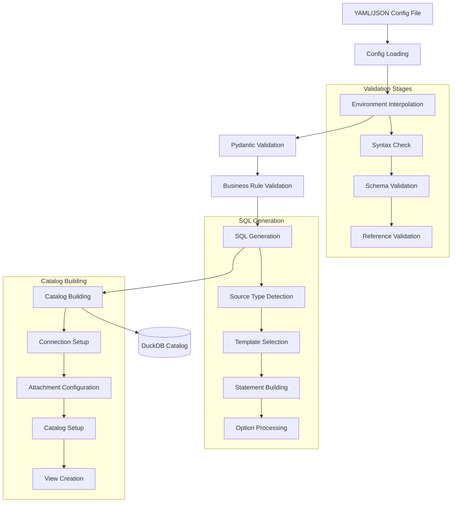

## Complete Data Flow Architecture

Here's the complete end-to-end data flow from configuration file to functional DuckDB catalog:

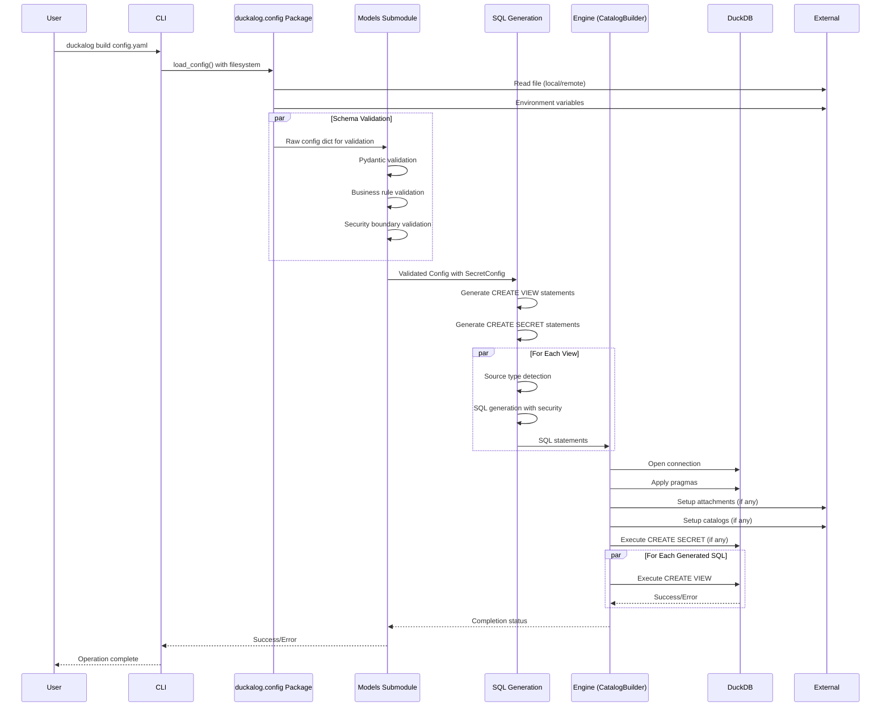

## Path Security Architecture

### Security Boundaries and Validation

Duckalog implements comprehensive path security to prevent directory traversal attacks while maintaining usability:

**Path Security Principles:**
- **Rooted Resolution**: All relative paths are resolved relative to the configuration file location
- **Traversal Protection**: Blocks attempts to escape the configuration directory tree
- **Parent Directory Access**: Allows controlled access to parent directories for shared resource patterns
- **Cross-Platform Security**: Consistent validation across Windows, macOS, and Linux

**Security Validation Flow:**


**Path Resolution Behavior:**
- **Relative Paths**: `data/file.parquet` → `/config/dir/data/file.parquet`
- **Parent Access**: `../shared/data.parquet` → Allowed if within security bounds
- **Security Blocks**: `../../../etc/passwd` → Security error
- **Remote URIs**: `s3://bucket/file.parquet` → No local path resolution

**Implementation Details:**
- **`validate_path_security()`**: Core validation function
- **`is_within_allowed_roots()`**: Checks path boundaries
- **`normalize_path_for_sql()`**: SQL-safe path formatting
- **`validate_file_accessibility()`**: Runtime accessibility verification

## Secret Management Architecture

### Canonical Secret Model

Duckalog uses a unified `SecretConfig` model for all credential management:


**Secret Types Supported:**
- **S3**: Access keys, secret keys, regions, endpoints
- **Azure**: Connection strings, tenant IDs, client credentials
- **GCS**: Service account keys, JSON credentials
- **HTTP**: Bearer tokens, custom headers
- **PostgreSQL**: Connection strings, host/port/user/password

**Security Features:**
- **Environment Variable Integration**: `${env:VARIABLE_NAME}` substitution
- **No Secrets in Config**: All sensitive data via environment variables
- **Automatic Redaction**: Logging automatically hides sensitive information
- **DuckDB Integration**: Direct mapping to DuckDB `CREATE SECRET` statements

## Remote Configuration Architecture

### Remote Access Support

Duckalog supports loading configurations from remote sources using fsspec-compatible filesystems:

**Supported Protocols:**
- **S3**: `s3://bucket/config.yaml` with AWS credentials
- **GCS**: `gs://bucket/config.yaml` with service account
- **Azure**: `abfs://account@container/config.yaml` with connection string
- **SFTP**: `sftp://server/path/config.yaml` with SSH keys
- **HTTP/HTTPS**: `https://example.com/config.yaml` with tokens

**Remote Loading Process:**


**Filesystem Integration:**
- **CLI Shared Options**: All remote access options centralized via Typer callback
- **Context Management**: Filesystem objects stored in `ctx.obj["filesystem"]`
- **Credential Handling**: Secure credential management through environment variables
- **Fallback Support**: Graceful degradation when remote dependencies unavailable

## Design Patterns and Architectural Decisions

### 1. Separation of Concerns

Duckalog strictly separates different responsibilities into distinct modules:

- **Configuration Layer**: File I/O, parsing, environment interpolation
- **Validation Layer**: Schema validation, type checking, business rules
- **Generation Layer**: SQL statement creation, template management
- **Execution Layer**: Database operations, connection management
- **Interface Layer**: CLI commands, user interaction

This separation provides several benefits:
- Easier testing and debugging
- Independent module evolution
- Clear extension points
- Reduced coupling between components

### 2. Config-Driven Design

The entire system revolves around declarative configuration:

**Benefits:**
- **Reproducibility**: Same config always produces same results
- **Version Control**: Configuration files can be tracked in Git
- **Testing**: Easy to create test scenarios with different configs
- **Collaboration**: Non-developers can understand and modify configurations
- **Documentation**: Config files serve as living documentation

**Extensibility:**
New source types can be added by:
1. Extending the `ViewConfig` Pydantic model
2. Adding SQL generation logic for the new source type
3. Implementing engine-side setup if needed
4. Updating documentation and examples

### 3. Idempotent Operations

All catalog building operations are designed to be idempotent:

- **View Replacement**: `CREATE OR REPLACE VIEW` ensures consistent results
- **Attachment Management**: Consistent attachment procedures regardless of current state
- **Schema Evolution**: Config changes are applied predictably
- **Rollback Safety**: Failed operations leave the catalog in a consistent state

### 4. Layered Architecture

The system follows a strict layered approach:

```
┌─────────────────────┐
│   CLI Interface     │  ← User interaction, command parsing
├─────────────────────┤
│   Config Layer      │  ← File I/O, environment handling
├─────────────────────┤
│   Validation Layer  │  ← Schema validation, type checking
├─────────────────────┤
│   Generation Layer  │  ← SQL creation, template management
├─────────────────────┤
│   Execution Layer   │  ← Database operations, connections
├─────────────────────┤
│   External Systems  │  ← DuckDB, S3, databases, catalogs
└─────────────────────┘
```

Each layer depends only on the layer directly below it, ensuring clear dependencies and testability.

### 5. Error Handling and Logging Patterns

**Error Handling Strategy:**
- **Fail Fast**: Validate configuration early to catch issues quickly
- **Descriptive Errors**: Provide actionable error messages with context
- **Graceful Degradation**: Continue processing non-dependent items when possible
- **Error Categorization**: Different exception types for different failure modes

**Logging Approach:**
- **Structured Logging**: Use consistent log formats and levels
- **Security Conscious**: Never log sensitive information (passwords, tokens)
- **Debug Support**: Detailed logging available for troubleshooting
- **User-Friendly**: Important operations logged at appropriate levels

## Configuration Schema Architecture

The configuration schema follows a hierarchical structure with the unified `duckalog.config` package:

```mermaid
graph TD
    ROOT[Config Root<br/>version, duckdb, secrets, attachments, iceberg_catalogs, views, semantic_models] 
    ROOT --> DB[DuckDB Config<br/>database, pragmas, settings]
    ROOT --> SECRETS[Secrets Config<br/>canonical secret definitions]
    ROOT --> ATTACH[Attachments Config<br/>duckdb, sqlite, postgres, duckalog]
    ROOT --> ICEBERG[Iceberg Catalogs<br/>catalog configs with auth]
    ROOT --> SEMANTIC[Semantic Models<br/>dimensions, measures, joins]
    ROOT --> VIEWS[Views List<br/>view definitions]
    
    SECRETS --> S3_SECRET[S3 Secret<br/>key_id, secret, region]
    SECRETS --> AZURE_SECRET[Azure Secret<br/>connection_string, credentials]
    SECRETS --> GCS_SECRET[GCS Secret<br/>service_account_key]
    SECRETS --> HTTP_SECRET[HTTP Secret<br/>bearer_token, headers]
    SECRETS --> PG_SECRET[PostgreSQL Secret<br/>connection parameters]
    
    ATTACH --> DUCKDB_ATTACH[DuckDB Attachment<br/>alias, path, read_only]
    ATTACH --> SQLITE_ATTACH[SQLite Attachment<br/>alias, path]
    ATTACH --> POSTGRES_ATTACH[PostgreSQL Attachment<br/>alias, host, port, user, password]
    ATTACH --> DUCKALOG_ATTACH[Duckalog Attachment<br/>alias, config_path, database]
    
    ICEBERG --> IC_CONFIG[Iceberg Catalog Config<br/>name, catalog_type, uri, warehouse, options]
    
    SEMANTIC --> SEM_DIM[Semantic Dimensions<br/>hierarchies, attributes]
    SEMANTIC --> SEM_MEAS[Semantic Measures<br/>aggregations, calculations]
    SEMANTIC --> SEM_JOIN[Semantic Joins<br/>relationships, cardinalities]
    
    VIEWS --> PARQUET_VIEW[Parquet View<br/>source: parquet, uri, options]
    VIEWS --> DELTA_VIEW[Delta View<br/>source: delta, uri, options]
    VIEWS --> ICEBERG_VIEW[Iceberg View<br/>source: iceberg, catalog, table]
    VIEWS --> DB_VIEW[Database View<br/>source: duckdb/sqlite/postgres, database, table]
    VIEWS --> SQL_VIEW[SQL View<br/>source: sql, query, file_ref]
```

## Security Architecture

### Comprehensive Security Model

Duckalog implements a multi-layered security approach:

**Security Layers:**
1. **Configuration Validation**: Schema validation and business rule enforcement
2. **Path Security**: Boundary validation and traversal protection
3. **Secret Management**: Environment variable integration and credential isolation
4. **SQL Generation Security**: Injection prevention and identifier quoting
5. **Remote Access Security**: Filesystem authentication and secure protocols

**Security Principles:**
- **Zero Secrets in Config**: All sensitive data via environment variables only
- **Principle of Least Privilege**: Minimal access required for each operation
- **Defense in Depth**: Multiple security checks at different layers
- **Secure by Default**: Conservative defaults that don't expose data

### Security Implementation Details

**Path Security Boundaries:**
- Configuration directory and controlled parent directory access
- Remote URI passthrough without local path resolution
- Cross-platform path normalization and validation
- Accessibility checks before operations

**Secret Security:**
- Automatic environment variable interpolation
- Log redaction for sensitive information
- Secure DuckDB secret creation
- No secret persistence in configuration files

**SQL Security:**
- Identifier quoting for all table/view names
- Literal escaping for string values
- SQL injection prevention in template processing
- Safe file loading with content validation

## Component Dependency Graph

Understanding the dependencies between components helps in maintenance and extension:

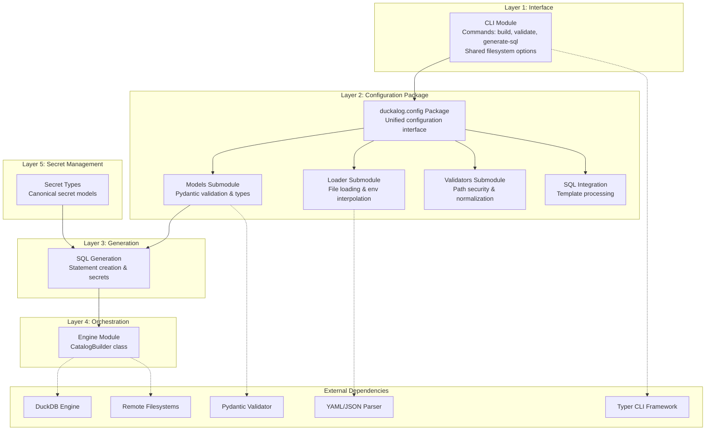

### Dependency Rules:
1. **No backward dependencies** - higher layers never depend on lower layers
2. **Clear interfaces** - each layer exposes well-defined interfaces
3. **Minimal coupling** - components only know about their direct dependencies
4. **Testable units** - each layer can be tested independently

## Extension Patterns

### Adding New Source Types

To extend Duckalog with a new data source type:

1. **Model Extension**:
   ```python
   class NewSourceViewConfig(BaseModel):
       name: str
       source: Literal["new_source"]
       uri: str
       options: dict[str, Any] = Field(default_factory=dict)
   ```

2. **SQL Generation**:
   ```python
   def generate_new_source_sql(view: NewSourceViewConfig) -> str:
       # Generate appropriate CREATE VIEW statement
       return f"CREATE OR REPLACE VIEW {view.name} AS ..."
   ```

3. **Engine Integration** (if needed):
   ```python
   def setup_new_source(engine, view: NewSourceViewConfig):
       # Set up any required connections or configurations
       pass
   ```

### Adding New Attachment Types

Similar extension pattern for database attachments:

1. Extend `AttachmentsConfig` model
2. Add attachment setup logic in engine
3. Update SQL generation if needed
4. Add validation rules

## Performance and Scalability Considerations

### Current Architecture Supports:
- **Large Configuration Files**: Efficient parsing and validation
- **Multiple Views**: Batch processing and optimization
- **Concurrent Operations**: Thread-safe where appropriate
- **Memory Management**: Streaming and chunked processing where needed

### Scaling Patterns:
- **Horizontal Scaling**: Multiple catalogs can be processed independently
- **Vertical Scaling**: DuckDB's in-memory processing for complex queries
- **External Optimization**: Leverage underlying system optimizations (S3, databases)

## Security Architecture

### Security Principles:
- **Zero Secrets in Config**: All sensitive data via environment variables
- **Connection Security**: SSL/TLS support for external connections
- **Access Control**: DuckDB's built-in security features
- **Audit Trail**: Config-driven approach provides built-in change tracking

### Security Measures:
- Environment variable validation
- Secure credential handling
- Connection security options (SSL modes)
- No credential logging or exposure

## Development and Testing Architecture

### Testing Strategy:
- **Unit Tests**: Individual module functionality
- **Integration Tests**: End-to-end catalog building
- **Configuration Tests**: Schema validation and parsing
- **SQL Generation Tests**: Output verification for different source types

### Development Workflow:
1. Configuration-driven development
2. Test-first approach for new features
3. Documentation integration
4. Continuous validation against specifications

## Future Architecture Considerations

### Potential Extensions:
- **Plugin System**: Dynamic loading of new source types
- **Caching Layer**: Configuration and SQL result caching
- **Monitoring Integration**: Metrics and observability
- **Multi-Catalog Management**: Orchestrating multiple catalog deployments

### Architectural Evolution:
The current architecture is designed to accommodate these future needs without major restructuring, thanks to its separation of concerns and extensibility patterns.

## Conclusion

Duckalog's architecture provides a robust, maintainable, and extensible foundation for building DuckDB catalogs from declarative configurations. The separation of concerns, config-driven design, and idempotent operations make it suitable for both development and production use cases, while the clear extension patterns support future growth and adaptation to new data sources and requirements.

## Getting Started with the Architecture

### For New Developers

1. **Start with the system overview** to understand Duckalog's purpose and high-level design
2. **Review the component descriptions** to understand each module's responsibilities
3. **Follow the data flow** to see how configuration becomes a catalog
4. **Examine the design patterns** to understand architectural decisions
5. **Look at extension examples** if you need to add new functionality

### For Contributors

- **Code contributions** should respect the separation of concerns
- **New source types** follow the documented extension patterns
- **Architecture changes** require OpenSpec proposals
- **Documentation updates** should maintain consistency across documents

### For System Integrators

- **API stability** is maintained through well-defined interfaces
- **Configuration evolution** follows semantic versioning principles
- **Extension points** are documented and tested
- **Error handling** provides actionable feedback for troubleshooting

## Related Documentation

- **[User Guide](guides/index.md)**: How to use Duckalog in practice
- **[API Reference](reference/index.md)**: Complete API documentation
- **Examples**: See the `examples/` directory for configuration samples
